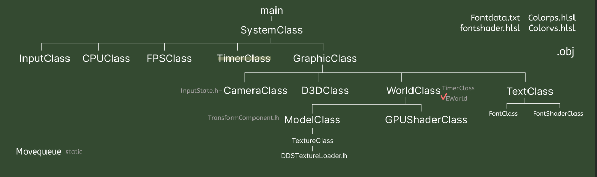
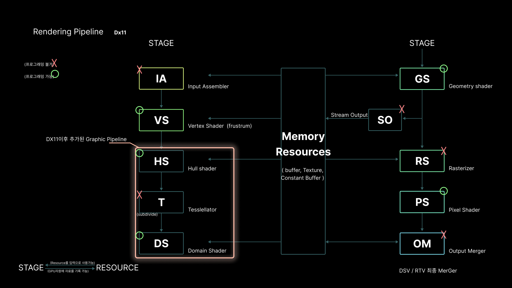

# DirectX 11 ThorPrj

## 🎬 Preview

<table width="100%" style="table-layout: fixed; border-collapse: collapse; border: none;"> <tr style="border: none;"> <td width="50%" style="text-align: center; border: none; padding: 5px;">  <br><strong>Main Play</strong> </td> <td width="50%" style="text-align: center; border: none; padding: 5px;">  <br><strong>Preview2</strong> </td> </tr> </table>


## 🛠️ 개발 환경/빌드(Environment & Build) Guide
**Development Tool:** Visual Studio 2022 
**Graphics API:** DirectX 11
**Target Architecture:** `x86` / `Release` Build 지원
**의존성:** 별도의 외부 그래픽 라이브러리 없이 Windows SDK 내장 DX11 API 활용


## 🚀 핵심 구현 기술 (Key Features)

### 01. DX11 자체 프레임워크 및 렌더 파이프라인 직접 구축

- **Description:** 외부 엔진의 도움 없이 Win API와 DX11을 활용해 로우레벨 엔진 아키텍처를 직접 설계
<table width="100%" style="table-layout: fixed; border-collapse: collapse; border: none;"> <tr style="border: none;"> <td width="50%" style="text-align: center; border: none; padding: 5px;">  <br><strong>전체 DX 프레임워크 직접 구축</strong> </td>  </tr> </table>

- **렌더링 파이프라인 구조:** GPU 파이프라인 흐름을 완벽히 제어하도록 구현
<table width="100%" style="table-layout: fixed; border-collapse: collapse; border: none;"> <tr style="border: none;"> <td width="50%" style="text-align: center; border: none; padding: 5px;">  <br><strong>Renderpipeline </strong> </td>  </tr> </table>

```
IA->VS->HS->T->DS->GS-> SO-> RS->PS->OM
```

### 02. 공간 좌표계 데이터 처리 (NDC ➡️ Screen ➡️ World)

- 마우스 스크린 좌표를 역행렬 연산을 통해 3D 월드 좌표로 복원, 역으로 월드 포지션을 투영하는 VSCompute 자체 구현

<table width="100%" style="table-layout: fixed; border-collapse: collapse; border: none;"> <tr style="border: none;"> <td width="50%" style="text-align: center; border: none; padding: 5px;">  <br><strong>NDC->Screen->World로의 Data처리</strong> </td>  </tr> </table>
++ NDC->Screen->해머 위치 Queue로의 데이터 처리

### 03. 빌보드 시스템 (Billboard System)

- 카메라의 뷰 행렬(View Matrix)을 기반으로 항상 카메라를 정면으로 바라보는 빌보드 컴포넌트를 구현하여 이펙트 및 정적 에셋 표현을 최적화

<table width="100%" style="table-layout: fixed; border-collapse: collapse; border: none;"> <tr style="border: none;"> <td width="50%" style="text-align: center; border: none; padding: 5px;">  <br><strong>BillBoard</strong> </td>  </tr> </table>
### 04. 추가 ArtResource관리 
- Bounding Box 관리 및 ArtResource 관리
<table width="100%" style="table-layout: fixed; border-collapse: collapse; border: none;"> <tr style="border: none;"> <td width="50%" style="text-align: center; border: none; padding: 5px;">  <br><strong>Houdini Prop Procedural Modeling</strong> </td>  </tr> </table>
- **Description:** 게임 엔진 내 효율적인 데이터 관리를 위해 Asset Bounding Box를 연산, 최적화된 아트 리소스 관리 파이프라인을 구축

- **Houdini 연동 Procedural Modeling:** Houdini를 활용해 절차적으로 생성된 프롭(Procedural Fence 등) 데이터를 프레임워크 내에 효율적으로 배치하는 테크니컬 아트 파이프라인을 검증(DX-Houdini Parameter 동적 연동 X)
